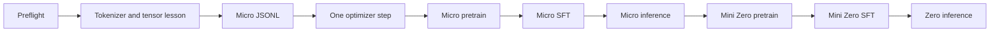

# MiniMind Colab learning workflow

Use [minimind_colab_learning.ipynb](minimind_colab_learning.ipynb) from top to bottom on a Google Colab A100 runtime. The notebook is deliberately ordered so that each conceptual checkpoint has a real command behind it:

The notebook expects a Git repository that includes this `colab/` directory. Before opening it in Colab, push this change to a branch and set `REPOSITORY_URL` and `REPOSITORY_REF` in the first configuration cell. It intentionally does not default to the upstream project because upstream does not contain this runner.

The runner has two profiles:

| Profile | Purpose | Model | Data |
|---|---|---|---|
| `micro` | Observe the mechanics cheaply and quickly | 256 hidden, 4 layers | First 2,048 non-empty records from each official mini JSONL |
| `zero` | Reproduce the repository's recommended MiniMind Zero path | 768 hidden, 8 layers | Official `pretrain_t2t_mini.jsonl` and `sft_t2t_mini.jsonl` |

`setup` creates `.colab-venv` with `--without-pip --system-site-packages`. Skipping `ensurepip` avoids failures in Colab images that disable it, while system site packages expose Colab's CUDA-enabled PyTorch. Because Colab's pip is not guaranteed to be importable from the new venv, setup uses the host `pip --python <venv-python>` interface to install pip and this repository's pinned dependencies into the venv. Re-running setup reuses and repairs the existing environment. `zero` is still a real data-and-GPU job: run it only after the full micro route succeeds.

The notebook's repository/setup cell is one CLI-only, fail-fast invocation without Python control flow or `subprocess`. It clones only when `ROOT` is absent; otherwise it verifies that `ROOT` is a Git checkout, fetches `REPOSITORY_REF`, and checks out the fetched revision. The same invocation then enters the repository and runs setup, so a Git failure cannot fall through into setup. Later cells use absolute runner/root arguments and do not depend on notebook working-directory state. Existing `.colab-venv`, downloaded data, checkpoints, and outputs are not deleted.

The `train` command delegates to `trainer/train_pretrain.py` and `trainer/train_full_sft.py`. Checkpoints continue to use the repository's `checkpoints/` convention, while weights are saved in `out/`. The notebook always passes native `--resume`: on a new run there is no checkpoint and training starts normally; after Drive restoration it resumes the matching stage. `--compile` is opt-in so the first run separates model/data problems from TorchInductor compilation.

For persistence, mount Google Drive before training. The notebook restores any prior saved `out/`, `checkpoints/`, and `logs/` state before a `--resume` run, starts a 10-minute incremental backup loop, and also copies state after each completed stage. The runner writes each native trainer's combined stdout/stderr to `logs/`. Use `--include-data` only when you also want the downloaded JSONL files copied.
