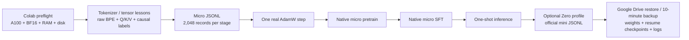

# MiniMind Colab Learning Workflow

| Field | Value |
|---|---|
| Round | 1 |
| Status | Complete - static/local validation |
| Scope | A step-by-step Google Colab learning workflow built around this repository's native MiniMind-3 training and inference entry points. |

## Conclusion

The project now contains a branch-ready Google Colab learning workflow. It starts with a random-initialized micro MiniMind model, shows tokenizer, causal-label, attention-projection, gradient, and optimizer mechanics, then moves to the native MiniMind Zero pretrain-to-SFT path. It delegates every actual model training call to the repository's existing trainer scripts, keeping the deliverable aligned with the checked-in model and checkpoint format.

## Delivered artifacts

| Artifact | Purpose | Exact archived copy |
|---|---|---|
| [colab/minimind_colab.py](../../colab/minimind_colab.py) | Setup, preflight, dataset download, micro slicing, lessons, native training, inference, backup, and restore | [minimind_colab.py](files/wzh-solution-2026-07-12-00-00/minimind_colab.py) (22,526 bytes) |
| [colab/minimind_colab_learning.ipynb](../../colab/minimind_colab_learning.ipynb) | Ordered Colab learning route | [notebook archive](files/wzh-solution-2026-07-12-00-00/minimind_colab_learning.ipynb) (6,900 bytes) |
| [colab/README.md](../../colab/README.md) | Usage, profile, native-checkpoint, and persistence guidance | [README archive](files/wzh-solution-2026-07-12-00-00/README.md) (2,451 bytes) |

SHA-256 values and byte counts are preserved in [artifact evidence](../wzh-steps/files/wzh-steps-2026-07-12-00-00/final-artifact-sha256.txt).

Pre-review versions are retained alongside the final archives with the `.pre-review` suffix, preserving the meaningful review-driven change history.

## Evidence

The runner passed Python compilation; the notebook passed JSON and Python-structure validation; and the micro model lesson executed against the current source, including Q/K/V and logits shape checks. See the complete [command evidence](../wzh-steps/wzh-steps-2026.07.12.00.00.md).

## Risks and operating boundaries

- The notebook intentionally has placeholder `REPOSITORY_URL` and `REPOSITORY_REF`; push this branch (or a fork containing `colab/`) and set both values before opening it in Colab. It cannot use the upstream default because upstream does not contain these new files.
- No A100 runtime, remote dataset download, tokenizer training, or model training was executed in this local validation round. Run `preflight --require-a100`, then the complete micro route, before enabling `RUN_ZERO_PROFILE`.
- Google Drive is a checkpoint/output store, not the training filesystem. The notebook restores saved state before native `--resume` training, backs up every ten minutes, and backs up after each stage; an interruption can still lose up to the backup interval.
- The optional tokenizer experiment produces an intentionally incompatible tokenizer in `model_learn_tokenizer/`; it is for observing BPE training only and must not be paired with MiniMind weights.
