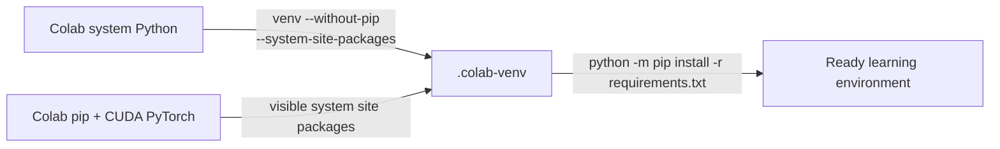

# MiniMind Colab `ensurepip` setup repair

| Field | Value |
|---|---|
| Round | 2 |
| Status | Fixed and locally verified |
| User-visible failure | Colab Python 3.12 venv creation aborted while invoking `ensurepip` |

## Conclusion

`setup` no longer invokes Colab's unavailable/broken `ensurepip` path. It now recreates or refreshes `.colab-venv` with `--without-pip --system-site-packages` on every setup run, then invokes pip through the venv interpreter. This also repairs the partial `.colab-venv` left by the failed first attempt.

## Root cause and evidence

The original command used Python's default venv behavior, which bootstraps pip through `ensurepip`. The supplied Colab runtime rejected that bootstrap. The workflow did not need it: `--system-site-packages` already makes Colab's installed pip and CUDA-enabled PyTorch visible. A disposable real venv probe confirmed this behavior, and a focused regression test locks down both the `--without-pip` flag and recovery when a partial `bin/python` already exists.

Complete command evidence is in [round 2 steps](../wzh-steps/wzh-steps-2026.07.12.19.32.md).

## Changed artifacts

| Artifact | Change | Exact archived copy |
|---|---|---|
| [colab/minimind_colab.py](../colab/minimind_colab.py) | Bypass `ensurepip`; refresh partial venvs idempotently | [archived runner](files/wzh-solution-2026-07-12-19-32/minimind_colab.py) |
| [colab/README.md](../colab/README.md) | Document Colab pip and CUDA package reuse | [archived README](files/wzh-solution-2026-07-12-19-32/README.md) |
| [tests/test_minimind_colab.py](../tests/test_minimind_colab.py) | Add regression coverage at the `command_setup` seam | [archived test](files/wzh-solution-2026-07-12-19-32/test_minimind_colab.py) |

The archived SHA-256 checksums are linked from the round steps. The user's modified `colab/minimind_colab_learning.ipynb`, including its execution output, was not changed.

## Verification and boundaries

- Focused regression test: passed.
- Actual disposable venv creation plus pip invocation: passed.
- Python compilation and whitespace validation: passed.
- A live Google Colab runtime was not available locally, so the user must pull/push the repaired revision and rerun the setup cell there. The repair directly removes the failing `ensurepip` invocation shown in the supplied traceback.
