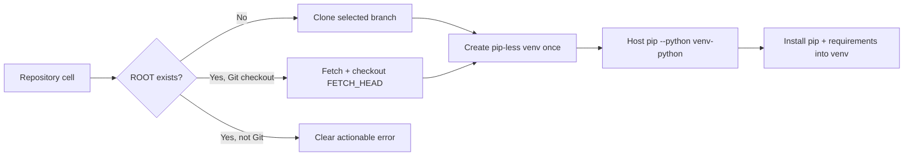

# MiniMind Colab repeatable setup repair

| Field | Value |
|---|---|
| Round | 3 |
| Status | Fixed and locally verified |
| Reported failures | Existing clone destination; missing pip inside `.colab-venv` |

## Conclusion

Both failures are fixed at their actual call sites.

The runner no longer assumes the target venv can import pip. It creates the venv only when its Python is absent, then uses the host `pip --python` interface to install pip and project dependencies into that interpreter. This directly handles the supplied `/content/minimind/.colab-venv/bin/python: No module named pip` error and repairs the partial venv on a rerun.

The notebook no longer runs unconditional `git clone`. An absent root is cloned; an existing Git checkout is fetched and updated to `REPOSITORY_REF`; an unrelated non-Git directory produces a clear error. Existing `.colab-venv`, data, outputs, and checkpoints are not deleted.

## Changed artifacts

| Artifact | Change | Exact final copy |
|---|---|---|
| [colab/minimind_colab.py](../colab/minimind_colab.py) | External pip targeting and partial-venv reuse | [archived runner](files/wzh-solution-2026-07-12-19-39/minimind_colab.py) |
| [colab/minimind_colab_learning.ipynb](../colab/minimind_colab_learning.ipynb) | Repeatable clone/update cell; cleared stale failure output | [archived notebook](files/wzh-solution-2026-07-12-19-39/minimind_colab_learning.ipynb) |
| [colab/README.md](../colab/README.md) | Document exact pip and repository behavior | [archived README](files/wzh-solution-2026-07-12-19-39/README.md) |
| [tests/test_minimind_colab.py](../tests/test_minimind_colab.py) | Lock both reported failures into regression coverage | [archived test](files/wzh-solution-2026-07-12-19-39/test_minimind_colab.py) |

The supplied failing notebook, pre-fix runner, and red regression test are retained alongside the final artifacts. Checksums, byte counts, and complete commands are in [round 3 evidence](../wzh-steps/wzh-steps-2026.07.12.19.39.md).

## Verification and remaining boundary

- Both regression tests pass.
- Host pip successfully targeted a disposable pip-less venv.
- Runner/test compilation and notebook structural checks pass.
- A live Colab runtime is not available locally. After this revision is pushed, reopen or refresh the notebook and rerun its repository/setup cell; it will fetch the repaired branch and reuse `/content/minimind` safely.
