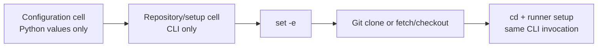

# MiniMind Colab CLI-only setup cell

| Field | Value |
|---|---|
| Round | 4 |
| Status | Implemented and verified |
| Design rule | Configuration and CLI execution are separate cells |

## Conclusion

The repository/setup cell is now one CLI-only, fail-fast command. Python configuration remains in the preceding configuration cell, while operational work is expressed solely through Git, shell `cd`, and `minimind_colab.py setup` in the same `set -e` invocation.

This retains the repeatable behavior added in round 3: an existing checkout is updated instead of cloned again; a missing checkout is cloned; a conflicting non-Git path fails clearly. Because setup is part of the same command, Git failure cannot fall through to stale or incorrect source. Later cells use absolute runner/root paths and do not depend on `%cd` state.

## Changed artifacts

| Artifact | Change | Exact final copy |
|---|---|---|
| [colab/minimind_colab_learning.ipynb](../colab/minimind_colab_learning.ipynb) | Separate config from CLI execution and clear stale output | [archived notebook](files/wzh-solution-2026-07-12-19-57/minimind_colab_learning.ipynb) |
| [colab/README.md](../colab/README.md) | Document CLI-only setup cell | [archived README](files/wzh-solution-2026-07-12-19-57/README.md) |
| [tests/test_minimind_colab.py](../tests/test_minimind_colab.py) | Prevent Python control flow from returning to the execution cell | [archived test](files/wzh-solution-2026-07-12-19-57/test_minimind_colab.py) |

The supplied notebook output and the initial regression source remain preserved beside the final artifacts. Full commands and outputs are in [round 4 evidence](../wzh-steps/wzh-steps-2026.07.12.19.57.md).

## Verification

- Three focused regression tests pass, including a real fail-fast shell probe.
- Notebook JSON and Python structure validate.
- All notebook outputs and execution counts are clean.
- Runner and test compilation pass.
- Independent standards/spec re-review found no remaining blocking specification issue; the final full local test suite and whitespace check pass.
