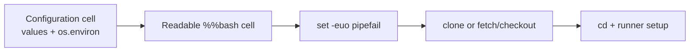

# MiniMind Colab readable Bash setup cell

| Field | Value |
|---|---|
| Round | 5 |
| Status | Implemented and validated |
| Outcome | Readable multi-line CLI with unchanged fail-fast behavior |

## Conclusion

The compressed one-line setup expression has been replaced by an ordinary, readable `%%bash` block. Configuration and execution remain separate: the Python configuration cell exports four strings, while the setup cell contains only shell commands.

The formatting change does not weaken behavior. Git/setup remains fail-fast, an existing repository remains repeatable, a conflicting non-Git path exits before setup, and later commands continue to use absolute runner/root paths.

## Changed artifacts

| Artifact | Change | Exact final copy |
|---|---|---|
| [colab/minimind_colab_learning.ipynb](../colab/minimind_colab_learning.ipynb) | Replace one-line CLI with formatted `%%bash` | [archived notebook](files/wzh-solution-2026-07-12-20-36/minimind_colab_learning.ipynb) |
| [colab/README.md](../colab/README.md) | Document environment export and multi-line Bash | [archived README](files/wzh-solution-2026-07-12-20-36/README.md) |
| [tests/test_minimind_colab.py](../tests/test_minimind_colab.py) | Enforce readable structure and line length | [archived test](files/wzh-solution-2026-07-12-20-36/test_minimind_colab.py) |

The exact previous one-line notebook and the regression source are preserved beside the final artifacts. Complete commands and outputs are in [round 5 evidence](../wzh-steps/wzh-steps-2026.07.12.20.36.md).

## Verification

- Three local regression tests pass.
- Bash-native syntax check passes.
- Notebook JSON, Python-cell syntax, output cleanliness, Bash structure, and line-length checks pass.
- Longest setup-cell line: 67 characters.
- Independent standards/spec review passed after verifying the complete audit command and the readable Bash implementation.
